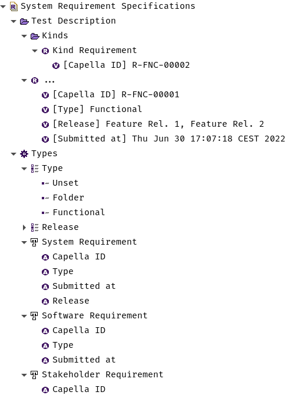

..
   SPDX-FileCopyrightText: Copyright DB Netz AG and the rm-bridge contributors
   SPDX-License-Identifier: Apache-2.0

.. _snapshot:

********
Snapshot
********

The snapshot is the input needed for calculating the change set. An example:

.. literalinclude:: ../../tests/data/snapshots/snapshot.yaml
   :language: yaml
   :lines: 5-
   :emphasize-lines: 1,3,12,40,49,54

The snapshot consists of 4 separate sections:

- introductionary part for the :external:class:`~capellambse.extensions.reqif.elements.RequirementsModule`, here only ``id`` is displayed but ``long_name``, ``text`` and other attributes can be declared.
- ``data_types``: For :external:class:`~capellambse.extensions.reqif.elements.EnumDataTypeDefinition`\ s, all needed options/values for :external:class:`~capellambse.extensions.reqif.elements.EnumerationValueAttribute`\ s,
- ``requirement_types``: For :external:class:`~capellambse.extensions.reqif.elements.RequirementType`\ s. The keys underneath are the identifiers from the RM tool and finally
- ``items``: For the exported work items that will result into :external:class:`~capellambse.extensions.reqif.elements.Requirement`\ s and :external:class:`~capellambse.extensions.reqif.elements.RequirementsFolder`\ s.

Enumeration Data Types (``data_types``)
=======================================

This section describes ``EnumDataTypeDefinition``\ s: For now only as a mapping
from ``long_name`` to its values.

.. warning::

    The current format does not allow for equally named
    ``EnumerationDataTypeDefinition``\ s such that
    ``EnumerationAttributeValue``\ s on separate ``RequirementType``\ s have
    different options available. For now there is only one shared DataType
    exploiting the availability in the ``RequirementsModule``. This makes it
    possible to choose values which shouldn't be available on the respective
    ValueAttribute.

Requirement Types (``requirement_types``)
=========================================

Polarion supports work item types as a special field. This section is therefore
a mapping that describes ``RequirementType``\ s from a given ``identifier`` to
its ``long_name`` and ``attribute_definitions`` (in short ``attributes``).
Therein the keys are matched against the ``data_types`` if it is an
``AttributeDefinitionEnumeration``.

``Requirement``\ s and ``RequirementFolder``\s (``items``)
==========================================================

This section consists of all work items and folders that are exported from the
RM tool. Important keys are the ``id`` (written to ``identifier``) and ``text``
(written to ``text``). The latter can also include referenced content like
images using the `data-URI`_ schema. The ``type`` field is an identifier for the
respective ``RequirementType`` and needs to also appear under
``requirement_types``.

.. _data-URI: https://en.wikipedia.org/wiki/Data_URI_scheme

The field data of work items is reflected by the ``attributes`` key. In general
fields are ``ValueAttributes`` in Capella. For now only the basic primitives
are supported:

- ``IntegerValueAttribute``
- ``StringValueAttribute``
- ``RealValueAttribute``
- ``DateValueAttribute``
- ``BooleanValueAttribute``
- ``EnumerationValueAttribute``

In order to have a nice display of these ``ValueAttribute``\ s in Capella and
also functioning ``.values`` for
:external:class:`~capellambse.extensions.reqif.elements.EnumerationValueAttribute`\
s, :external:class:`~capellambse.extensions.reqif.elements.AttributeDefinition`
and
:external:class:`~capellambse.extensions.reqif.elements.AttributeDefinitionEnumeration`\
s are needed. The previous snapshot will result into the following state:

